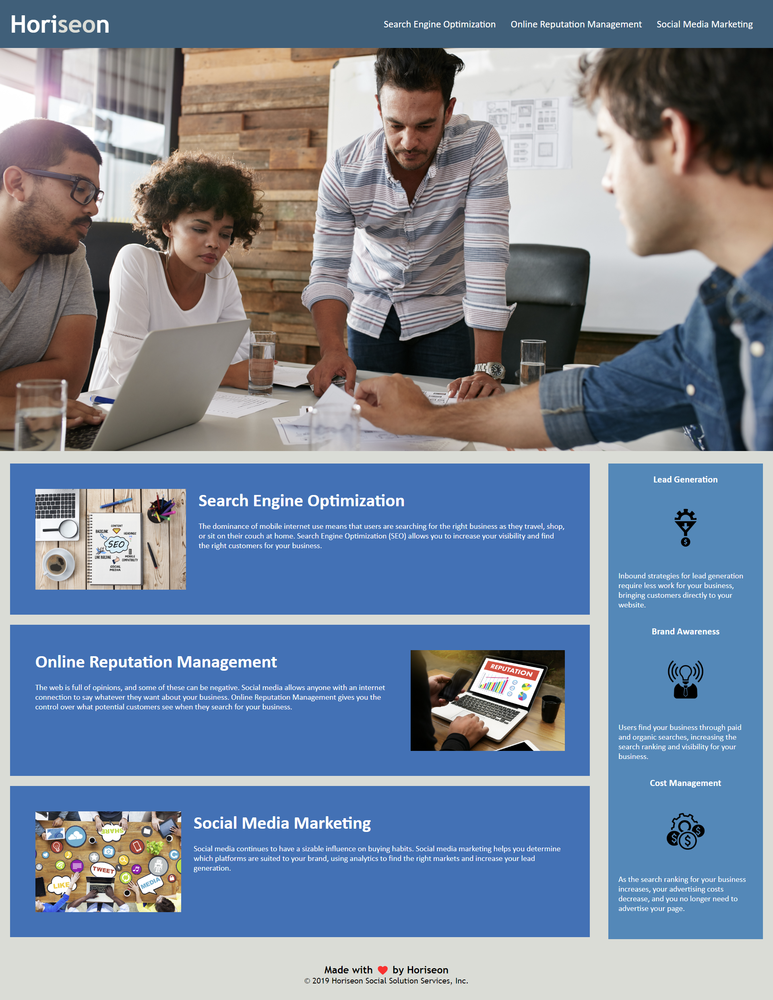

# Horiseon Solution Services Accessibility Corrections
## Description
The goal of this challenge was to refactor code for an existing site to add accessibility and semantic HTML features. The refactored sheet code looks the same as the non-accessible version.

### User Story from the assignment
```
AS A marketing agency
I WANT a codebase that follows accessibility standards
SO THAT our own site is optimized for search engines
```
### Acceptance Criteria from the assignment
```
GIVEN a webpage meets accessibility standards
WHEN I view the source code
THEN I find semantic HTML elements
WHEN I view the structure of the HTML elements
THEN I find that the elements follow a logical structure independent of styling and positioning
WHEN I view the icon and image elements
THEN I find accessible alt attributes
WHEN I view the heading attributes
THEN they fall in sequential order
WHEN I view the title element
THEN I find a concise, descriptive title
```
## Usage
To access the completed site, visit the [github pages version of this repository](https://kurohyou.github.io/Horiseon-Refactor-SC/). The original code can for the site can be found in the [Horiseon Page folder](/Horiseon%20Page) with the corrected code in the root directory.
## Credits
The base code is from the University of Utah Full Stack Bootcamp.